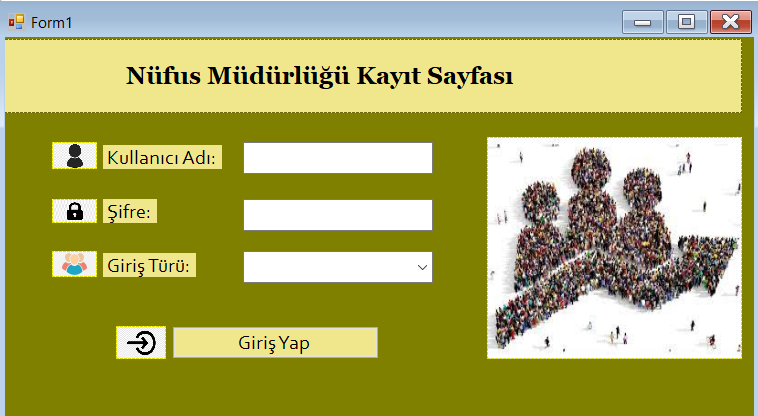
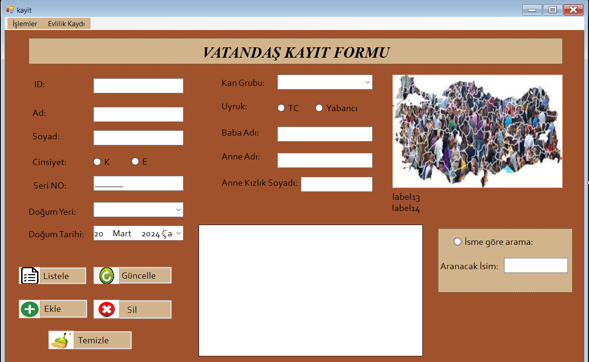
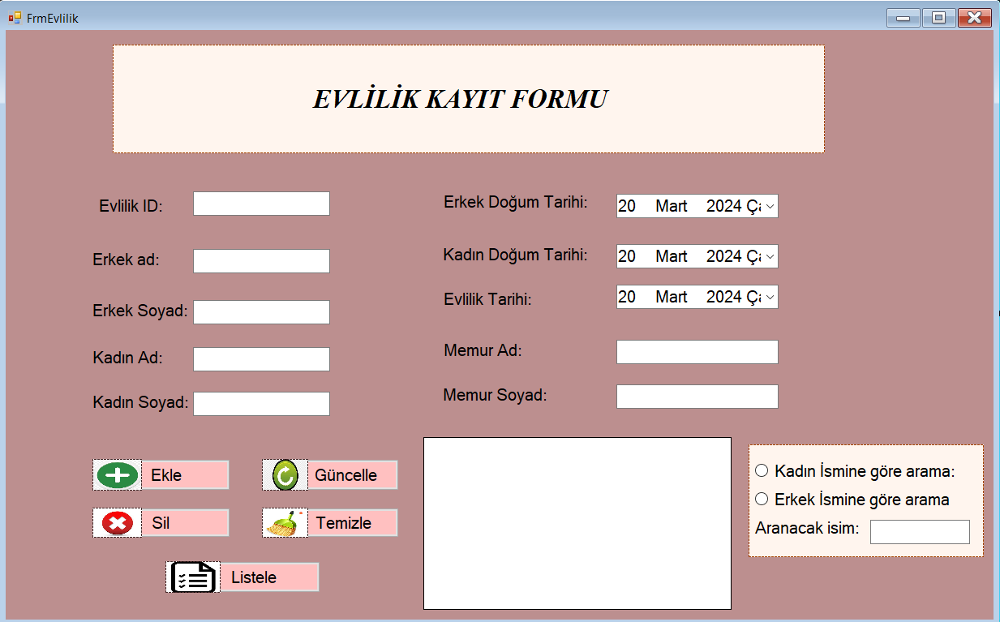
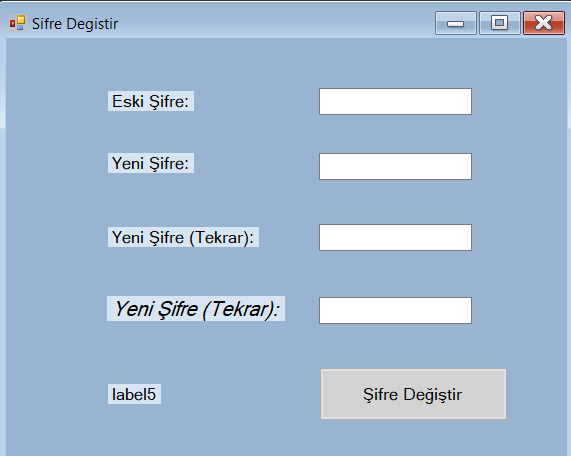
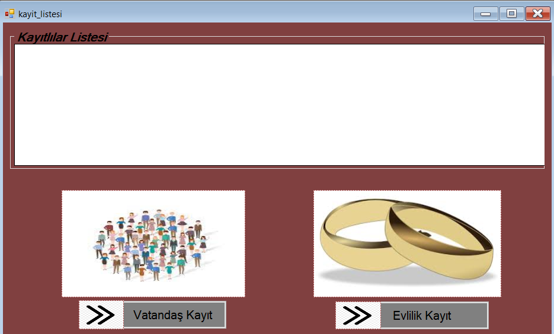

#Nufus_mudurlugu_otomasyonu
C# dili ile yazılmış, MSSQL kullanılarak veritabanı oluşturulan bir projedir.  

Olusturdugum proje nüfus bilgilerini, evlilik kayit bilgilerini veritabaninda kayit tutmak ve güncellemek için oluşturulmuş bir projedir. Bu proje ile daha hızlı ve güvenilir bir sekilde verilere erisim mümkün olur.
Kullanıcı adi,sifre girilerek ve giris seçenegi seçilerek giris yapilir.
Kullanici olarak 2 giris seçenegi mevcuttur:
  - Memur ve Yönetici Girisi
    

Memur'un görevleri:

-Vatandas formunda: ekleme, güncelleme, silme, kayitlar listeleme, isme göre aratma islemlerini yapabilir.

-Evlilik formunda: ekleme, güncelleme,silme, kayitlar listeleme, kadin ve erkek ismine göre aratma islemlerini yapabilir.

Yöneticinin görevleri:

- Memur'un görevlerini yapabilir.
- Sistemin kontrolünü saglar. 
- Herhangi bir yanlislikta islemleri yenileyebilir.
- Sifre degisikligi yapabilir.

-Olusturulan kayitlari görebilir.

